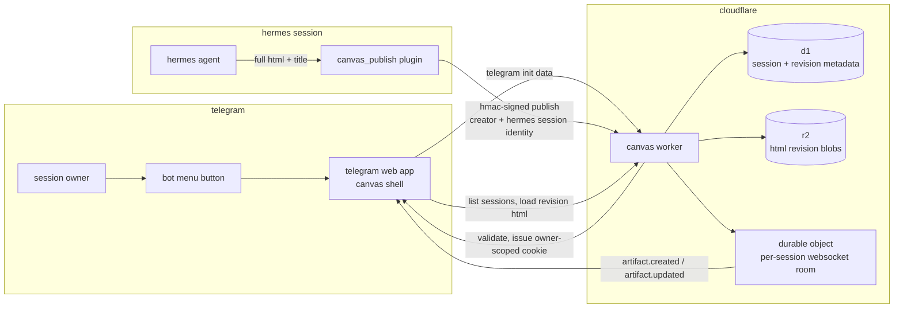

# Telegram Canvas

A Telegram Mini App that lets you browse, live-view, revise, and manage HTML
artifacts scoped to your own Hermes sessions.

https://github.com/user-attachments/assets/5106033c-6e25-43f3-88a2-31f3c8e852a6

## Architecture



### How a session gets a canvas

1. The user opens the bot's menu button. Telegram launches the canvas shell as a
   Web App, carrying signed init data for that Telegram user.
2. The shell sends that init data to the Worker. The Worker validates it with the
   bot token, derives an owner hash, and gives the shell a short-lived,
   owner-scoped session cookie.
3. During the matching Hermes conversation, `canvas_publish` reads the trusted
   gateway session context, then HMAC-signs the HTML artifact and sends it to the
   Worker. The model never supplies the identity fields itself. Tiny trust issue,
   huge future headache avoided.
4. The Worker derives a stable session hash from the Hermes session ID, stores
   metadata in D1 and the HTML revision in R2, then emits an update through that
   session's Durable Object WebSocket room.
5. The already-open Mini App receives the update, refreshes its session view,
   and loads the current revision. The result is a live canvas scoped to the
   Telegram user and the Hermes conversation that produced it.

- **Worker**: Cloudflare Workers with D1 metadata, R2 revision blobs, and Durable
  Object WebSocket rooms.
- **Mini App**: Vanilla TypeScript frontend, built by Vite, served as Workers
  Assets. Opens from the Telegram bot menu button.
- **Plugin**: Hermes directory plugin adding a `canvas_publish` tool.

## Repository Layout

```
telegram-canvas/
├── .github/workflows/   — CI and production/preview deployment
├── worker/
│   ├── src/             — Worker TypeScript source
│   ├── public/          — Mini App frontend (Vite build)
│   ├── test/            — Vitest + Miniflare integration tests
│   ├── package.json
│   ├── wrangler.jsonc   — Cloudflare Workers configuration
│   └── vite.config.ts   — Frontend build config
├── hermes-plugin/       — Hermes canvas_publish plugin
├── scripts/             — One-shot provisioning and configuration
├── docs/                — Operations, setup, and threat model
└── .dev.vars.example    — Required secret names (copy to .dev.vars)
```

## Local Development

```bash
cd worker
npm ci
npm run dev          # Vite dev server + wrangler dev
npm test             # Vitest with Miniflare integration
npx wrangler deploy --dry-run  # Validate config without deploying
```

## Required Secrets

| Secret | Where | Purpose |
|---|---|---|
| `TELEGRAM_BOT_TOKEN` | Worker secret, `.dev.vars` | Verify Telegram WebApp init data |
| `PUBLISHER_SECRET` | Worker secret, Hermes env | HMAC sign publish requests |
| `IDENTITY_HMAC_KEY` | Worker secret | Derive owner/session hashes |
| `DOCUMENT_TOKEN_KEY` | Worker secret | Mint document tokens |

## License

MIT
