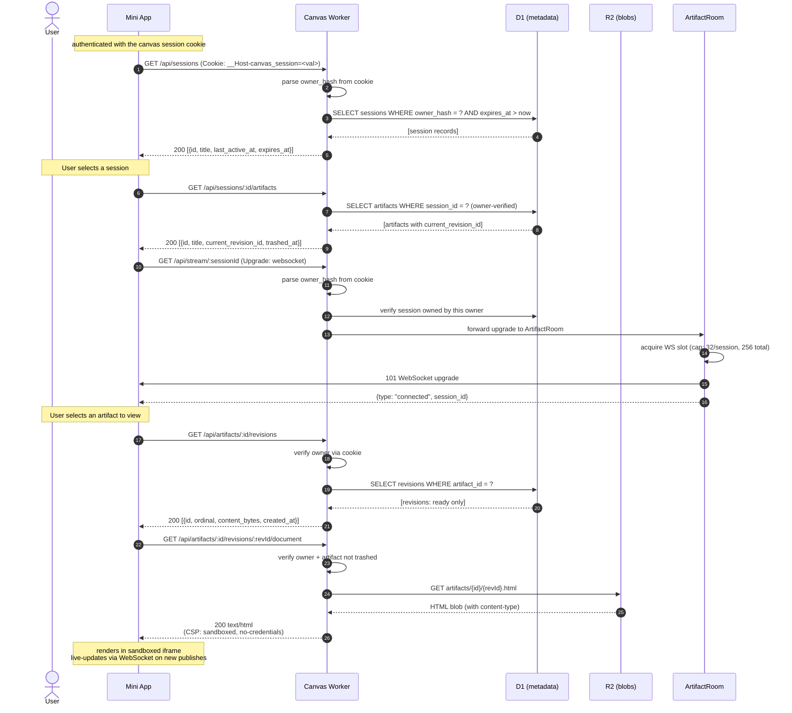
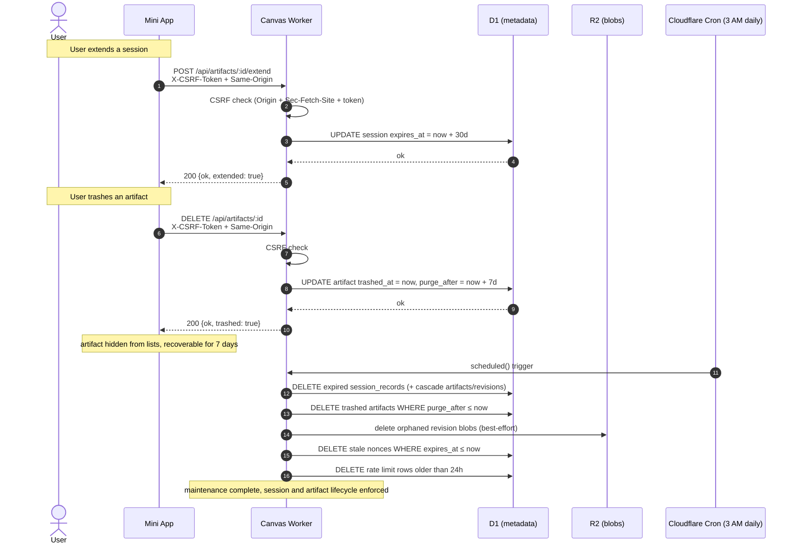

# Canvas Sequence Diagram

## Auth: Telegram Mini App Shell Login

```mermaid
sequenceDiagram
    autonumber
    actor User
    participant TG as Telegram
    participant Mini as Mini App (canvas shell)
    participant Worker as Canvas Worker
    participant D1 as D1 (metadata)
    participant R2 as R2 (blobs)

    User->>TG: tap bot menu button
    TG->>Mini: launch WebApp with initData (HMAC-signed)
    Mini->>Worker: POST /api/auth/telegram (init_data, form-encoded)

    rect rgb(20,30,50)
        Note over Worker: Telegram auth validation
        Worker->>Worker: parse initData query string
        Worker->>Worker: verify HMAC-SHA256 using bot token
        Worker->>Worker: check auth_date ≤ 24h old
        Worker->>Worker: derive owner_hash = HMAC(IDENTITY_KEY, "telegram-owner:<user_id>")
    end

    Worker->>Mini: Set-Cookie: __Host-canvas_session=<uuid>.<owner_hash>
    Worker-->>Mini: 200 {ok, user: {id, first_name}}
    Note over Mini: cookie stored, viewer API authenticated
```

## Publish: Hermes Agent Pushes an Artifact

```mermaid
sequenceDiagram
    autonumber
    actor User
    participant Hermes as Hermes Agent
    participant Plugin as canvas_publish plugin
    participant Worker as Canvas Worker
    participant D1 as D1 (metadata)
    participant R2 as R2 (blobs)
    participant DO as ArtifactRoom (Durable Object)
    participant Mini as Mini App (via WS)

    User->>Hermes: "publish this diagram to canvas"
    Hermes->>Plugin: canvas_publish({title, html})

    rect rgb(30,20,50)
        Note over Plugin: identity from gateway context (not model-supplied)
        Plugin->>Plugin: read telegram_creator_id, hermes_session_id from session env
        Plugin->>Plugin: build canonical string: v1\nPOST\n/internal/publish\n...
        Plugin->>Plugin: HMAC-SHA256(body, PUBLISHER_SECRET) → signature
    end

    Plugin->>Worker: POST /internal/publish<br/>x-canvas-key-id, x-canvas-timestamp, x-canvas-nonce, x-canvas-signature

    rect rgb(20,30,50)
        Note over Worker: HMAC validation
        Worker->>Worker: resolve key from key-id
        Worker->>Worker: check clock skew ≤ 5 min
        Worker->>Worker: verify HMAC signature
        Worker->>D1: insert nonce (atomic dedup)
        Worker->>Worker: parse body, validate fields
        Worker->>Worker: check rate limits (owner: 60/h, session: 10/m)
        Worker->>Worker: check feature flags (publish kill switch)
        Worker->>Worker: derive owner_hash, session_hash
    end

    Worker->>D1: find or create session_record<br/>WHERE owner_hash + session_hash
    D1-->>Worker: session {id, expires_at}

    alt existing artifact (revision)
        Worker->>D1: verify artifact owned by this owner
        D1-->>Worker: artifact found
    else new artifact
        Worker->>D1: check artifact count ≤ 100
        Worker->>D1: INSERT artifact
    end

    Worker->>D1: INSERT revision (status = "pending")
    Worker->>R2: PUT artifacts/{id}/{revId}.html (HTML blob)
    R2-->>Worker: ok

    rect rgb(20,40,30)
        Note over Worker: crash-safe: pending→ready transition
        Worker->>D1: UPDATE revision status = "ready"
        Worker->>D1: SET current_revision_id on artifact
        Worker->>D1: touch session (extends expiry +30d)
        Worker->>D1: prune revisions > 20 (best-effort)
        Worker->>R2: delete pruned revision blobs (best-effort)
    end

    Worker->>DO: POST /broadcast {type: "artifact.created", artifact_id, revision_id}
    DO->>DO: store event to durable storage
    DO-->>Mini: WS message {type: "artifact_update", data: {type, artifact_id}}
    Worker-->>Plugin: 200 {ok, artifact_id, revision_id, ordinal, action}
    Plugin-->>Hermes: canvas published ✓
    Hermes-->>User: "here's your canvas: [link]"

    Note over Mini: receives WS event → refreshes artifact list → loads new revision
```

## Viewer: Browsing & Live-Viewing Canvases

## Lifecycle: Expiry, Trash & Cron Maintenance

